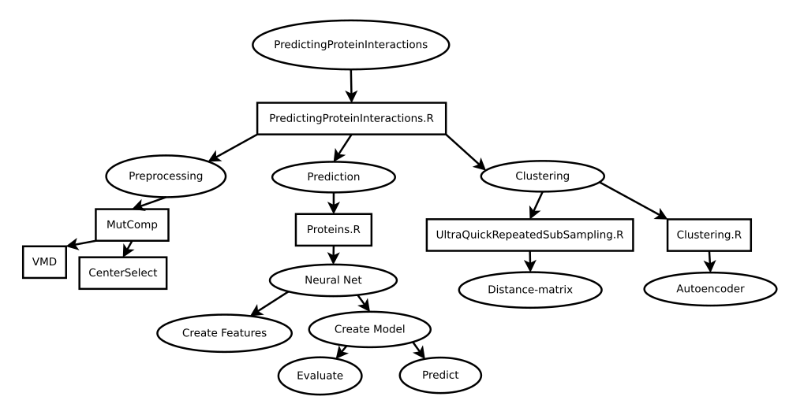
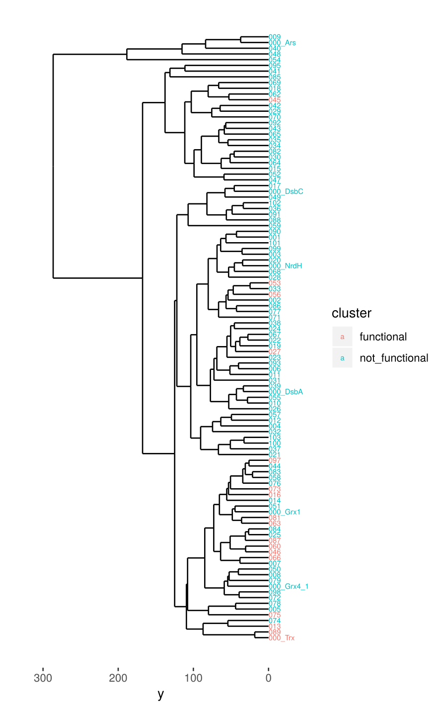

# Predicting Protein Interactions
Predict protein-interactions from raw pdb(protein-databank)-files. 
This diagram illustrates the different functionallities of this software-tool and how the different parts relate to each other





## Installation
 A script that trys to install all necessary dependencies can be found in *setUp/setUp.sh*. Install all dependencies by typing:
```
./setUp.sh
```
In order to view this documentation on your local machine type:
 
```
./docs/createDoc.sh
```
This requires *mkdocs* to be installed.


## 1. Predicting Protein Interactions


## 2. Preprocessing

### Mutcomp
([MutComp](https://github.com/WillyBruhn/MutComp)). 

The standard path to the parameters-file is (for the use on the WS):
```
/home/sysgen/Documents/LWB/TCL/MutComp/GUI/Parameters/parameters.txt
```
. To run the script type:
```
<pathToMutComp>./process.sh
```
where **pathToMutComp** is the path to the script.
If you want to use a different parameter-file just pass it as an argument to the script
```
<pathToMutComp>./process.sh <path/to/a/different/parametersfile>
```
On my machine this call becomes: 
```
/home/willy/PredictingProteinInteractions/PreProcessingProteins/MutComp/./process.sh /home/willy/PredictingProteinInteractions/PreProcessingProteins/MutComp/GUI/Parameters/parametersForThesis.txt
```

I strongly recommmend placing the **parametersFile** for each data-set in the same folder. 


### centerSelect
([centerSelect](https://github.com/WillyBruhn/centerSelect)). 

## 3. Prediction
Based on the approximation of the DE multiple features are calculated. Then data-augmentation is performed. 
Then a neural net is trained. The neural net can then be used to predict if two given proteins react with each other.

### Proteins.R
Given the positive and negative potential of the proteins and the active center
calculate multiple features. These features are the quantiles of the approximation
of the DE (Distribution of Eccentricities). The features are then used to train
a neural net.

There are two options:

1. training a neural net and evaluating with k-fold-Cross-Validation. Additionally this model can be exported.
2. using a pre-trained model to make predictions on new data.

If you only want to generate the features (e.g. in case you want to call Clusterin.R afterwards) run with
onlyGenerateModels = TRUE

#### Requirements:
- In the protein-folder the .obj-file has to be present which is delivered by MutComp.
- If the measure should be updated with the information about the active center, then
the file "active_center.pts" has to be present which is delivered by selectCenter.R.


#### Usage

```
  pathToExperiment    ... path to the folder that contains all the folders of all proteins. (Output-folder of MutComp).

  onlyGenerateModels  ... 1: only generate the features of the models. Else the features are generated and then the neural-net
                             is trained.

  mode                ... prediction/evaluation. Either make predictions on new data or perform k-fold-cv to evaluate a model.

  parametersFile      ... contains the parameters need for the features and the neural net. Separated by ; the arguments
                          are inserted row-wise. If no parametersFile is specified then the default-parameters are used..

  outPutFolder        ... name of the folder in which all output is saved. The folder is placed in
                          <pathToExperiment>/NNexperimentsKfoldCV/. So <outPutFolder> is no full path!
```

Most of the ~50 parameters are specified in an additional **parameters-file**. Note that when executing this script the 
parameters specified on the commmand-line have higher priority and overwrite the parameters in the **parameters-file**.


#### Parameters related to the features
```
  a1,a2,a3,a4,a5      ... specifies how important the active site is. a1, b1, n1 together form the parameters for one
                          feature. Set to -1 if you want to use fewer features.

  b1,b2,b3,b4,b5      ... specifies how important the boarder region is. a1, b1, n1 together form the parameters for one
                          feature. Set to -1 if you want to use fewer features.

  mNearestNeighbors   ... how many points in close proximity to the boarder-area are considered.

  n1,n2,n3,n4,n5      ... in (0,1). Specifies how local the feature is. a1, b1, n1 together form the parameters for one
                          feature. Set to -1 if you want to use fewer features.

  recalculateModel    ... specifies if the preprocessing should be recalculated. If set to 0, if the file allready exists
                          it is not recalculated.

  recalculateQuants   ... specifies if the quantiles should be recalculated. If set to 0 then if the file allready exists
                          it is not recalculated.

  n_s_euclidean       ... number of points to select with the euclidean fps (farthest-point-sampling-procedure).

  n_s_dijkstra        ... number of points to select with the geodesic fps (farthest-point-sampling-procedure).

  stitchNum           ... number of points that are created from Manifold.
```
#### Parameters related to the neural net


#### Exemplary Parameters-File
An exemplary parameters-file is shown below. The parameters for both the features and the 
neural net are stored in this file. The columns are ","-separated.

| parameter         | value                                                           |
|-------------------|-----------------------------------------------------------------|
| a1                | 1                                                               |
| a2                | 1                                                               |
| a3                | 1                                                               |
| a4                | 1                                                               |
| a5                | 1                                                               |
| b1                | 1                                                               |
| b2                | 1                                                               |
| b3                | 1                                                               |
| b4                | 1                                                               |
| b5                | 1                                                               |
| n1                | 0.1                                                             |
| n2                | 0.2                                                             |
| n3                | 0.3                                                             |
| n4                | 0.5                                                             |
| n5                | 0.8                                                             |
| mNearestNeighbor  | 10                                                              |
| pathToExperiment  | /home/willy/PredictingProteinInteractions//data/106Test/Output/ |
| n_s_euclidean     | 1000                                                            |
| n_s_dijkstra      | 1000                                                            |
| stitchNum         | 2000                                                            |
| recalculateModel  | 0                                                               |
| recalculateQuants | 0                                                               |
| sampleSize        | 20                                                              |
| l1                | 100                                                             |
| l2                | 100                                                             |
| l3                | 100                                                             |
| l4                | 50                                                              |
| l5                | 30                                                              |
| d1                | 0.2                                                             |
| d2                | 0.2                                                             |
| d3                | 0.2                                                             |
| d4                | 0.2                                                             |
| d5                | 0.2                                                             |
| epochs            | 20                                                              |
| batchSize         | 16                                                              |
| experimentName    | Dummy                                                           |
| recalculateNN     | 0                                                               |
| kFolds            | 10                                                              |
| numPermutations   | 400                                                             |
| numCores          | 4                                                               |
| mode              | evaluation                                                      |

#### Output
For each fold three files are created: **accuracy.txt**, **f1_score.txt**, **confMat.txt** storing the accuracy, the F1-score and the confusion-matrix. Additionaly three such files with tex-extensions are created which are obtained by averaging over the folds. 


#### Creating a classifier and evaluating it 
If mode is set to "evaluation" then the necessary features are generated as specified in **parametersFile**. 
Then with k-fold cross-validation a neural net is trained. For each fold the accuracy, F1-score and confusion-matrix is saved.
In case of k == 1 additionally the finall trained model is exported. This model can then be used for prediction of new data.

An exemplary confusion-matrix (with k == 1) looks like this:
|                 | functional | not_functional |
|-----------------|------------|----------------|
| functional      | 0.90000000 | 0.02865169     |
| not_functional  | 0.10000000 | 0.97134831     |

Keep in mind that with lower k, that means a lower number of different folds, the reliabilty of the evaluation of the model for new unseen data shrinks. 
With k == 1, the evaluation is only a training-error and hence does not show how well the model will perform on unseen data.

#### Predicting new data
If mode is set to "predict" then a previously trained neural net is read in and a folder containing new data has to be specified.
For the proteins in that new folder predictions are made with the neural net.


## 4. Clustering
Create dendrograms like this one from the 106-Redoxin-data-set:




### UltraQuickRepeatedSubSampling.R
Calculate all pairwise distances between the proteins. From this distance-matrix build an agglomerative bottom-up clustering.

Calculate the repeatedSubSampling fast. The points are only sampled m times once for each protein. Then the distributions are calculated. Then from these distributions the quantile-
approximation is calculated. The DE is then calculated with the manhattan distance between
the quantiles.

#### Usage

```
  ProteinsPath        ... path to all proteins as produced by MutComp

  distance_name       ... folder in which all distance-matrices will be stored

  n                   ... number of points to select (see parameters of RepeatedSampling)

  m                   ... sqrt(number of repeatitions)

  q                   ... number of subdivisions of the integral. Basically a higher q
                          leads to a more accurate approximation. Currently it has to hold
                          q < n.

  potential           ... pos/neg

  distance_method     ... geo/emd


  plot                ... in case of (q == 2) the approximations are ploted into the 2d-plane.
                          Else no plot is created with a warn-message.


  labels              ... a file containing for each protein a label functional/not_functional

  cores               ... number of cores to run on. Trys to detect the number of cores
                          automatically. If this fails the number of cores is set to 6
                          by default.
```

### Clustering.R
Train an auto-encoder that reduces the number of features of the proteins. Then the
bottle-neck-layer is extracted and used to extract a condensed representation of
the proteins. With these condensed representations then an agglomerative, bottom-up
clustering is performed. With this clustering then a dendrogram is obtained.


#### Usage
```
  inputPath           ... path to a file with a .Rdata-extension that stores the feature-matrix for
                          all proteins. Can be obtained by running Proteins.R.

  dendrogramName      ... name of the dendrogram-file. Without the (.pdf)-extension and prefix Dendrogram.

  numPermutations     ... number of permutations that are created for each representation. For
                          each protein m rows from the feature-matrix are combined. The order of
                          this m rows is randomly permutated and numPermutations different
                          representations are created.

  m                   ... number of rows from the feature-matrix that are combined for each protein-model.

  epochs              ... number of epochs to train the autoencoder.

  batchSize           ... size of a batch. Relevant for the training.

  l1,l2,l3            ... specifies the encoder-dimensions, that is the size of each layer in the network.
                          The autoencoder in this implementation has 3 layers.

  d1,d2,d3            ... in [0,1) specifies the dropout-rates.
```


